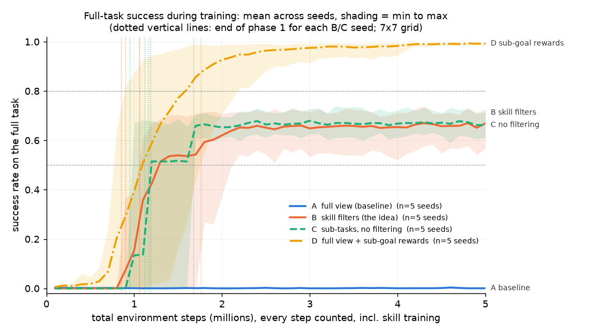

# Results: do skill filters make an RL agent learn faster?

**The claim tested:** *"An agent trained with randomly sampled skill filters reaches a given
success rate on the full task in fewer total environment steps than an agent that sees
everything from the start."*

Every number below comes from `results/` and can be regenerated with `python analyze.py main`.
Unless a line says otherwise, a number is a **mean over 5 independent seeds per condition**
(n = 5), and comparisons are **between conditions, seed against seed**.

---

## 1. Verdict

**The claim is technically supported, but the skill filters are not the reason. The idea
behind it is not supported.**

Under the rule fixed before the runs (DECISIONS.md §6), B beats A:
- B (skill filters) reached 50% success on the full task in **5 of 5 seeds**, after a median
  of **1.3M** steps.
- The full-view baseline A **never** got off the floor: 0.2% final success, 0 of 5 seeds
  reached 50% in 5M steps.
- One-sided exact Mann–Whitney p = 0.004, the smallest value possible with 5 vs 5 seeds.

That win does not mean what it seems to:
1. **The baseline learned nothing at all.** My calibration rule required A to end between 20%
   and 90%. That could not be met at any setting I could afford, so this is "something vs
   nothing", not "faster vs slower".
2. **The gain comes from the extra reward information, not the filters.** D is the plain
   full-view agent given the same sub-goal rewards (key picked up, door opened), with no
   filters and no controller. D reached 50% at least as fast as B (median 1.1M) and 80% at a
   median of 1.2M. It finished at **98.7%**, against B's **63.6%**. B never reached 80% in
   any seed.
3. **The filtering itself made no measurable difference.** C is identical to B but with no
   masking. C did the same as B: 63.4% vs 63.6% final success, median 1.2M vs 1.3M to reach
   50%.

In this experiment, cutting the game into masked skills plus a controller is clearly worse
than simply rewarding the same sub-goals in the full game. The masking adds nothing on top of
the sub-task decomposition.

---

## 2. Main plot and numbers

*Mean across 5 seeds; shading spans the worst to the best seed. The x-axis counts **every**
environment step, including phase-1 skill training for B and C. Their full-task success is 0
until their controller exists. The dotted vertical lines mark where each B/C seed ended
phase 1. Curve data: `results/main_curves.csv`.*

| Condition | Steps to 50% (5 seeds) | Steps to 80% (5 seeds) | Final success (500 eval episodes per seed) | Average success over the whole run |
|---|---|---|---|---|
| **A** full view, sparse reward | not reached ×5 | not reached ×5 | **0.2%** ± 0.2 | 0.1% |
| **B** skill filters (the idea) | 1.1M, 2.2M, 1.3M, 1.1M, 1.3M (median 1.3M) | not reached ×5 | **63.6%** ± 3.9 | 50.4% |
| **C** sub-tasks, no filtering | 1.2M, 1.2M, 1.2M, 1.7M, 1.0M (median 1.2M) | not reached ×5 | **63.4%** ± 4.0 | 51.1% |
| **D** full view + sub-goal rewards | 1.0M, 1.3M, 0.8M, 1.1M, 1.8M (median 1.1M) | 1.1M, 1.5M, 0.9M, 1.2M, 2.2M (median 1.2M) | **98.7%** ± 1.2 | 76.0% |

How to read the columns:
- **Steps to 50% / 80%**: the end of the first 100k-step window in which the training
  episodes hit that success rate.
- **Final success**: 500 test episodes on new random layouts after training. "±" is the
  standard deviation across seeds. The 500-episode test itself is accurate to about ±2
  points per seed.
- **Average success over the whole run**: the area under the curve, a one-number summary of
  learning speed.

Per seed, final success:

| | s0 | s1 | s2 | s3 | s4 |
|---|---|---|---|---|---|
| A | 0.0% | 0.4% | 0.0% | 0.4% | 0.0% |
| B | 65.4% | 58.2% | 60.8% | 66.8% | 67.0% |
| C | 64.8% | 57.8% | 61.6% | 68.4% | 64.4% |
| D | 99.6% | 99.4% | 98.0% | 99.6% | 97.0% |

All 20 runs are reported; none were dropped. Full statistics: `results/main_summary.txt`.

---

## 3. Why did B beat A? What B vs C and B vs D tell us

### B vs D: the help comes from the reward information

B knows about the sub-goals in two ways. Its key_door skill was rewarded for picking up the
key and opening the door, and its training was split into three easier games. D gets only the
first: the same sub-goal rewards (+0.2 for the key, +0.2 for the door), but in the full game,
with the full view and a single policy.

That alone was enough. D's average went from nothing to over 90% by 1.9M steps and 97% by 2.9M. B started from the
same knowledge, added the decomposition and the controller, and ended **35 points lower**.
Every D seed reached 80% before any B seed did; no B seed ever did. Every D seed also ended
above every B seed. In both cases the one-sided exact p is 0.004 (this direction was not
pre-registered, so treat it as explanation, not as a second test).

So **"A could not learn but B could" is explained by the sub-goal rewards**, which A lacks
and both B and D have. In plain words: A only gets a reward when it reaches the goal, and a
nearly random agent almost never manages key → door → goal in a row. It basically never sees
a reward, so it has nothing to learn from. D and B both get small rewards along the way.

### B vs C: the filtering itself does nothing measurable here

C is B without the masks. The skill policy always sees the whole map, but it trains on the
same sub-tasks with the same rewards and the same task-ID input, and it gets the same
controller.

| | B (masked) | C (unmasked) |
|---|---|---|
| Phase 1 length (steps until all sub-tasks ≥ 90% in training) | median 1.06M (0.85–1.76M) | median 1.16M (0.95–1.67M) |
| Skill alone at end of phase 1: navigate / hazard / key_door | 100% / 84% / 100% | 100% / 83% / 100% |
| Steps to 50% on the full task | median 1.3M | median 1.2M |
| Final full-task success | 63.6% | 63.4% |

All per-seed comparisons are well inside noise (one-sided p between 0.35 and 0.75).

There is a design reason for this, and I should have seen it before running. During skill
training, objects irrelevant to the sub-task are **removed** from the map (my reading of
"inert"). So a `navigate` or `key_door` training episode contains nothing the filter would
hide. B's masked view and C's raw view are identical there. I checked: the mask changed 0%
of observations in those episodes. In `hazard` episodes it hides one cell, the already-open
door. The masks only change anything in the **full task**, and there both B and C hit the
same ceiling for the same underlying reason (section 4).

### Why do B and C both stop around 64%?

Both are limited by the same structure: skills trained on hazard-free sub-tasks, then
switched between by a controller. The `key_door` skill never learned to avoid lava or balls,
because they were never there. The controller has to hand control to that skill to get the
key and open the door, and the agent then walks into hazards it was never trained to avoid.
Section 4 shows this in the numbers.

D learns the whole task in one policy, so it never has a blind phase.

---

## 4. Failure causes in the full task

From 500 test episodes per seed (2,500 per condition):

| Outcome | A | B | C | D |
|---|---|---|---|---|
| success | 0.2% | 63.6% | 63.4% | 98.7% |
| died in lava | 16.6% | 19.3% | 13.4% | 0.3% |
| hit a moving ball | 0.1% | 13.0% | 8.9% | 0.0% |
| timed out | 83.2% | 4.1% | 14.4% | 0.9% |

**A** mostly times out: it learned to stay alive but not to solve anything. 38% of its
timeouts happen while holding the key, but only 3% with the door open.

**B: which filter was active when it failed** (909 failures out of 2,500 episodes):

| Filter active at the end | lava | ball | timeout |
|---|---|---|---|
| `key_door` (hides lava and balls) | **338** | **178** | 1 |
| `navigate` (hides lava and balls) | 65 | 91 | 1 |
| `hazard` (shows lava and balls) | 80 | 55 | 100 |

**The answer to your specific question:** in B, **83% of all deaths (672 of 807) happened
while the active filter was hiding the thing that killed the agent**. That is 27% of all
episodes. Most of them were under `key_door`: the controller chose it about 53% of the time,
because it is the only skill that can fetch the key and open the door, and while it is active
the agent literally cannot see the lava or the ball. B's remaining failures are mostly
timeouts after the door was already open (96% of its timeouts).

**C, same breakdown:** C's skill policy sees everything, so nothing is hidden from it.
Counted the same way, 74% of C's deaths (410 of 556) still happened under a skill whose
training episodes never contained that hazard. So the blind phase isn't about the pixels
being masked. A skill trained without hazards doesn't avoid them even when it can see them.

**How often the controller picks each filter** (share of steps in the test episodes):

| | navigate | hazard | key_door |
|---|---|---|---|
| B (mean of 5 seeds) | 8% | 38% | 53% |
| C (mean of 5 seeds) | 42% | 25% | 33% |

B's controllers behave fairly consistently across seeds: key_door to get through the door,
hazard for most of the rest. C's controllers vary a lot between seeds; for example, s2 almost
never uses `hazard` and s4 uses `navigate` 74% of the time. Since the skill sees everything in
C, several skills can do overlapping jobs.

---

## 5. Limitations, and what I would test next

**Limitations — please read these before trusting the verdict:**

1. **The baseline is at the floor.** A never learned, at any grid size or hazard density I
   tried (calibration below). So "B is faster than A" really means "B learns, A doesn't".
   With tuned exploration or a much bigger budget A might learn, and the B-vs-A gap would
   shrink. D shows that the missing ingredient is the sub-goal reward, not a better
   architecture.
2. **A bug invalidated my first set of runs.** I found it, fixed it and reran everything
   (DECISIONS.md §7). The observation buffer for A, C, D and the controllers stored the same
   observation 128 times per rollout. In the buggy runs B looked like a big winner over C and
   D. That result was entirely the bug. The invalid runs are kept in
   `results/invalid_aliasing_bug/` and a regression test now guards against it.
3. **"Inert" was implemented as "absent".** That made B and C see the same thing during skill
   training, so this experiment mostly tests what masks do *after* training, in the full
   task. Leaving the objects in the room but harmless ("lava that doesn't kill") would be a
   different, arguably fairer test of filtering during training.
4. **One small environment** (7×7, one lava cell, one ball), one set of PPO settings (not tuned
   for any condition), one sub-goal bonus size (0.2), K = 4, a frozen skill policy, and a
   fixed phase-1 stopping rule. 5 seeds per condition.
5. **The learning curves come from training episodes**, with the policy acting randomly
   according to its learned probabilities. The final numbers come from separate test
   layouts. The two agree within a few points.

**What I would test next, in order:**
1. **Make every filter show lethal objects** (lava and balls visible in every filter). The
   failure breakdown says this is the single biggest problem with the design. It would tell
   us whether a "safe" filter design closes the gap to D.
2. **Inert = present but harmless** in sub-task episodes, so the masks matter during skill
   training too (a real B-vs-C test of the filtering).
3. **Let the skill keep learning in phase 2** (your first optional item). The skills could
   then learn to avoid hazards in the full game. This would probably help C more than B,
   since B's key_door skill still can't see the hazards.
4. **Get A off the floor** (longer budget or an exploration bonus, tuned on A only and reused
   everywhere). Then the claim can be tested as "faster", not "learns vs doesn't".
5. Larger grids and a second environment (e.g. Crafter) to see whether D's advantage holds as
   tasks get longer.

I did not run the optional extensions. The main work and its rerun after the bug used about
5.3 h of the 8-hour budget, and a 2–3-seed version of an extension would have invited more
reading into it than it could support.

---

## Appendix: sanity checks and calibration

**Sanity checks** (`results/sanity.txt`, `results/calib_summary.txt`):

| Check | Result |
|---|---|
| Random policy scores ≈ 0% on the full task | ✅ 0.2% success (2,000 episodes; 28% lava deaths, 71% timeouts) |
| Each sub-task is learnable on its own under its filter | ✅ Every B seed: navigate 100%, hazard 78–86%, key_door 100% (300 test episodes each); also the separate sanity run at size 9: 100% / 73% / 100% |
| Baseline learns something on the full task within the budget | ❌ No. A ends at 0.0–0.4% in all 5 seeds and both calibration runs (see limitation 1) |
| Masks do what they should | ✅ Before/after printouts in `results/sanity.txt`. Example: under `key_door` the lava `~`, ball `o` and goal `G` disappear; under `hazard` the door disappears. |

**Calibration** (condition A only, 5M-step budget, valid runs after the bug fix):

| Grid | Lava | Episode limit | Result |
|---|---|---|---|
| 7×7 | 8% (2 cells) | 4·size² | 0.2% at 5M |
| 9×9 | 8% | 4·size² | 0% at 2.8M (stopped) |
| 11×11 | 8% | 4·size² | 0% at 1.1M (stopped) |
| 7×7 | 4% (1 cell) | 4·size² | **0% at 5M ← frozen setting** |
| 7×7 | 4% | 10·size² | 0.3% at 1.7M (stopped) |

No setting met the 20–90% target. The frozen one is the smallest, least hazardous layout that
still needs all three skills. DECISIONS.md explains why and what that costs.

**Compute:** 4 CPU cores, no GPU. Everything (both rounds, including the invalid one) ran in
about 5.3 hours of wall clock with 4 runs in parallel. The 20 final runs took about 2 hours.
